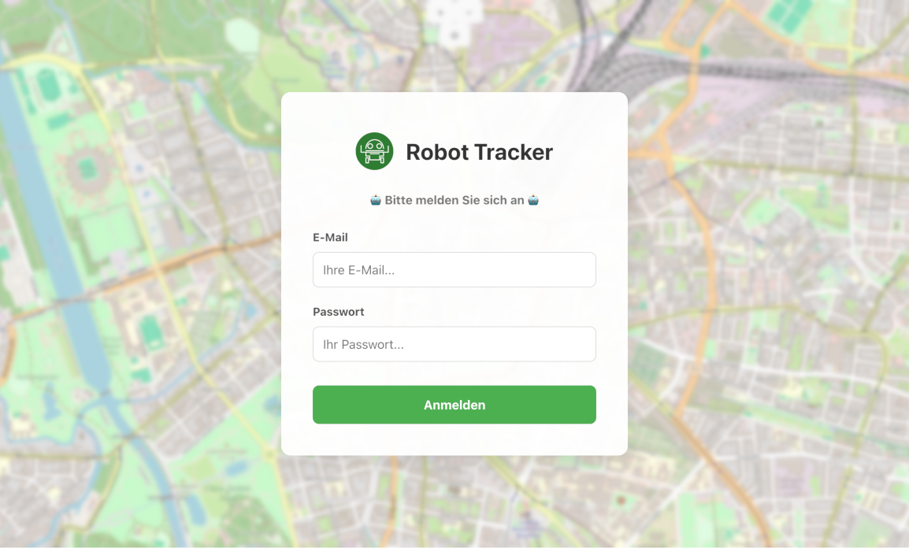
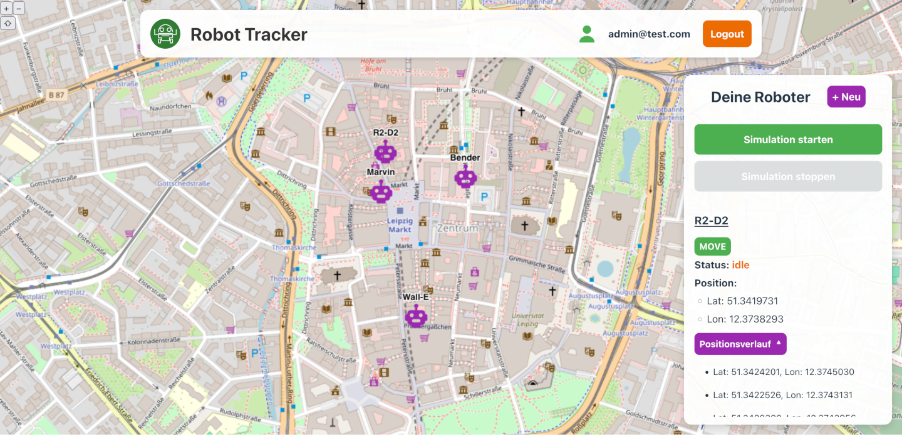

# Robot Tracker

## Installation

```
git clone https://gitlab.com/arrief/robot-tracker.git
cd robot-tracker
docker compose up --build
```

Das Frontend läuft auf `http://localhost:5173`, die API auf Port `3000`, Postgres DB auf `5432` und Redis auf `6379`.

## Architektur

Das Frontend ist eine klassische **React** SPA mit **React Router**, Vanilla JavaScript und CSS und zwei Bereichen, bestehend aus mehreren Komponenten. Die Hauptseite ist `src/pages/Dashboard.jsx`, eine Token-geschützte Seite, die die Websocket-Verbindung mit dem Backend herstellt und die Simulation verwaltet. Im Backend (**Node.js** mit **Express.js**) läuft die WebSocket-Verbindung über **socket.io**, während **Redis** einen Cache für die Abfrage aller Roboter-Daten aus der **PostgreSQL** Datenbank erstellt. Verschiedene Controller Funktionen reagieren auf die Anfragen aus dem Frontend, bis auf das Login sind alle Routen geschützt. Die Simulation selbst und der Broadcast der Ergebnisse über WebSocket erfolgt in `simulation/robotMovementSimulator.js`.

## Features:

-   Login (Testnutzer aus Aufgabenstellung ist angelegt)
-   Dashboard mit Header, OpenLayers Karte und Robotern als Marker
-   Sidebar mit Übersicht der Roboter-Daten und Buttons für folgende Aktionen:
    -   Erstellen eines neuen Roboters
    -   Bewegen und stoppen aller Roboter
    -   Bewegen und stoppen individueller Roboter
    -   Anzeigen eines Logs mit den 10 letzten Positionen




